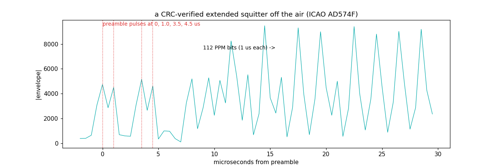

# ADS-B / Mode S (1090 MHz) — the fastest grid most people ever receive

Every airliner overhead shouts its position twice a second at
1090 MHz. The grid is pure pulse timing — no carrier tracking, no
equalizer, just a microsecond ruler.

## The grid

| parameter | value | why |
|---|---|---|
| Carrier | 1090 MHz | worldwide allocation |
| Modulation | PPM (pulse-position), **1 µs per bit**, 0.5 µs pulses | amplitude-only: decodable with the crudest receiver imaginable |
| Preamble | pulses at **0, 1.0, 3.5, 4.5 µs**, then 3.5 µs of silence | an aperiodic pattern that can't false-trigger on data |
| Frame | 56 or **112 bits** (extended squitter = ADS-B) | 120 µs total on air |
| Bit encoding | pulse in 1st half-µs = 1, in 2nd = 0 | self-clocking |
| Integrity | **CRC-24** (poly 0xFFF409) | doubles as the addressing mechanism |
| Position | Compact Position Reporting (CPR), even/odd frame pairs | 17-bit lat/lon halves that interlock |

## What we measured (30 s, 9:45 PM Sunday, RSPdx + rabbit ears indoors)

```
preamble candidates: 15831   CRC-24 verified frames: 31
first verified frame: DF=17 ICAO AD574F
```

Thirty-one CRC-clean extended squitters from seven aircraft in half a
minute, on *rabbit ears*. The candidate-to-verified ratio (15831 → 31)
is the honest part: at 1090 MHz, impulse noise fakes preambles
constantly, and the CRC is the only referee that matters.



## Four lessons this entry cost (all now baked into `measure.py`)

1. **Never capture pulsed signals with AGC on.** The AGC rides gain up
   between bursts, then the bursts clip. Our first capture had
   spectacular-looking pulses and zero decodable frames.
2. **The CRC generator's leading term is not optional.** Mode S parity
   uses the 25-bit generator **0x1FFF409**; writing it as "0xFFF409"
   and hand-aligning shifts produces division that never reduces —
   and a synthetic test frame built with the same broken constant
   *passes*, because self-consistency is not correctness. Constants
   must be validated against live signal or an independent decoder.
3. **Threshold on median+MAD, not mean+σ** — on a short capture the
   frames themselves inflate the σ until the threshold climbs above
   its own peaks.
4. **Take each correlation cluster's argmax, not its first sample** —
   a noise shoulder can open the cluster microseconds early and push
   the true preamble outside your alignment scan.

The debugging method is the story: differential testing against a
reference decoder ([aeroTuna](https://github.com/Felbs/aeroTuna),
which pulls 35/30 s from the same capture with its confidence-guided
rescue) localized each bug in minutes — slicer perfect at truth
(112/112 bits), so suspect the detector; detector fine, so suspect
the constant.

## Reproduce it

```
python measure.py --iq capture.cs16 --fs 2000000
```
30 s at 1090 MHz, ANY antenna (really — rabbit ears log airliners),
**fixed gain, AGC off**, generous RF gain (the pulses are brief).

## Reproduce it

```
python measure.py --iq capture.cs16 --fs 2400000
```
Any antenna works surprisingly well at 1090 MHz — we log airliners on
*rabbit ears*. Range scales with antenna quality and altitude.
