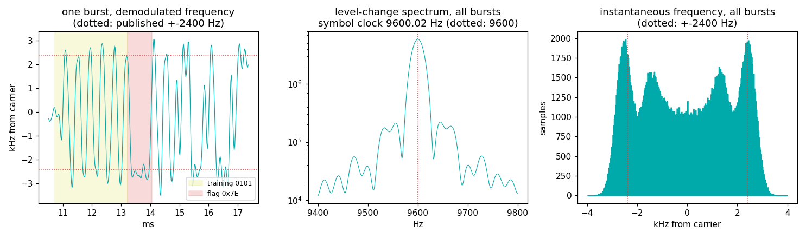
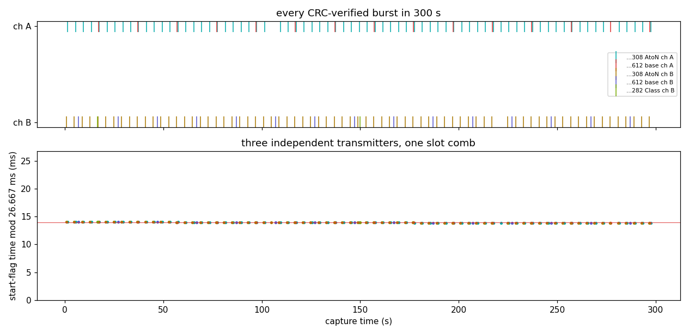

# AIS (161.975 / 162.025 MHz) — the grid ships organize without a boss

Every other grid in this atlas has a master: a tower, a clock house, a
GPS-disciplined transmitter. AIS has none. Every ship, buoy, and shore
station carves each UTC minute into **2250 slots of 26.6667 ms**,
listens to who booked what, and reserves its own — SOTDMA,
self-organized TDMA. The grid exists only because everyone agrees on
the ruler: 9600 bps GMSK, and a slot edge that never drifts off UTC.

## The grid

| element | value | why |
|---|---|---|
| Channels | A = **161.975**, B = **162.025 MHz** (25 kHz each) | transmissions alternate A/B for redundancy |
| Modulation | **GMSK 9600 bps**, BT 0.4, h = 0.5 → **±2400 Hz** | decodable with a plain FM discriminator |
| Line code | **NRZI** (a 0 flips the level) over HDLC | |
| Framing | 24-bit **0101 training**, **0x7E flags**, bit stuffing | classic HDLC, straight from the packet-radio era |
| Integrity | **CRC-16/X.25** (residual 0xF0B8) | a verified frame is the gold standard of proof |
| Slot | **256 bits = 26.6667 ms**, 2250 per minute | one position report fits one slot |
| Frame | 60 s, phase-locked to **UTC** | every transmitter disciplines itself to GPS time |

## What we measured (300 s, 8:19 AM Monday, roof discone, DC metro near the Potomac)

```
synthetic self-test: 5/5 CRC-verified recoveries
burst candidates: A 92, B 94 in 300 s
CRC-verified frames: 179 (A 88, B 91)
training 0101 (last 20 bits before flag) bit-exact: 179/179
symbol clock: 9600.02 Hz (+25.0 dB) — published 9600
GMSK deviation: raw fit +2425 Hz, calibrated +2472 Hz -> h = 0.515
SOTDMA slot comb (T = 26.6667 ms): five streams, phases 0.5213..0.5249
  max pairwise phase spread: 0.10 ms; residual jitter 68 us rms
msg-4 UTC time-of-day vs capture clock: offset +0.852 s, spread 0.1 ms
msg-4 date fields: {'2006-12-04': 30} (capture date 2026-07-20)
```

| constant | published (ITU-R M.1371) | measured |
|---|---|---|
| symbol rate | 9600 bps | 9600.02 Hz, +25.0 dB line, unrestricted search |
| training sequence | 0101… before the flag | bit-exact in 179/179 frames |
| flags + CRC | 0x7E, CRC-16/X.25 | **179 CRC-verified frames** from 186 burst candidates |
| slot period | 26.6667 ms, UTC-locked | 3 independent transmitters (5 streams) on one comb, ≤ 0.10 ms apart, 68 µs rms jitter |
| GMSK deviation | ±2400 Hz (h = 0.5) | ±2470 Hz (h ≈ 0.52) after ruler calibration — a real ~3–5 % overdeviation |
| base-station report rate | msg 4 every 10 s | 10.000 s, 30/30 |
| channel carrier | 161.975 / 162.025 | −130…−180 Hz off nominal ≈ our 1 ppm TCXO |

Who was talking: almost nobody afloat. One **AtoN** (aid-to-navigation,
147 two-slot type-21 reports, every 4.000 s on each channel), one
**USCG base station** (30 type-4 reports), and exactly **one Class B
vessel** (one position report + one static report). Counts only —
identities and positions stay off this page.



Left: one burst's demodulated frequency — the 0101 training, the 0x7E
flag, then payload. Middle: the 9600 Hz clock standing 25 dB out of
the level-change spectrum of all bursts. Right: the deviation
histogram hugging ±2400 (inner shoulders are Gaussian-filter ISI, not
extra FSK levels).



The bottom panel is the whole point of AIS: a shore station, a buoy,
and a passing boat — three transmitters that have never met — all
drop their start flags on the same 26.6667 ms comb for five straight
minutes, agreeing to a tenth of a millisecond.

## The base station that lives in 2006

All 30 base-station reports carry the date **2006-12-04** — while
their time-of-day field tracks our NTP-disciplined capture clock with
0.1 ms spread. 2026-07-20 minus 2006-12-04 is exactly **7168 days =
1024 weeks**: the station's GPS receiver never got the week-number
rollover patch. The grid keeps perfect time while being wrong about
what day it is — slot discipline comes from the seconds, and the
seconds are flawless.

Honesty notes:

- **AGC was on** for this capture — the sin our own ADS-B entry warns
  about. We got away with it (96 % of candidates decoded) because AIS
  bursts are 27–37 ms, long enough for the loop to behave. Use fixed
  gain anyway.
- **One vessel in five minutes.** This far up the Potomac on a Monday
  morning, the "ship grid" is mostly infrastructure talking to
  itself. Zero ships would also have been an honest result; the
  SOTDMA contention story needs a busier harbor.
- **The comb proof is cross-source phase agreement, not a period
  scan.** The AtoN repeats every 4.000 s, so its bursts alone fold
  perfectly at *any* divisor of 4 s — a naive best-period search
  "finds" combs that aren't there. The evidence is three independent
  transmitters landing on one phase.
- **The deviation ruler needed calibrating.** Our channel filter +
  discriminator smoothing reads a known synthetic 2400 Hz burst as
  2354 Hz (×0.981); the quoted ±2470 is bias-corrected, and the
  template choice still moves it ~2 % (h = 0.515–0.523). The TX
  Gaussian BT is **not** measurable through this chain at all —
  synthetic BT 0.40 reads 0.35 — so we don't claim it.
- The +0.852 s msg-4 offset is our capture-start timestamp latency,
  not the station's error — a 0.1 ms spread over 5 minutes says their
  tick is solid.
- The AtoN's 4 s report rate is a local configuration (nominal
  schedule is minutes); reported as observed.

## Reproduce it

```
python measure.py --iq capture.cs16 --fs 250000 [--meta capture.json]
```

Dial 162.000 MHz (both channels land at ±25 kHz), 250 kS/s, a few
minutes anywhere near navigable water — shore stations and AtoNs
answer even when no ship does. The script proves its own receiver on
synthetic GMSK bursts before it touches your file, masks every MMSI,
and never prints a position.
