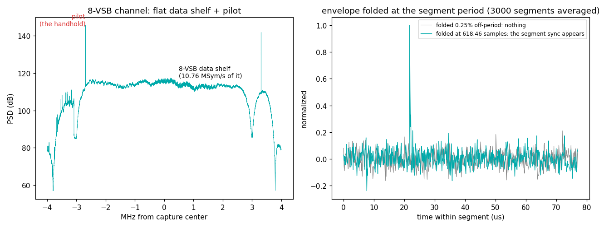

# ATSC 1.0 (8-VSB) — the grid that carries American television

## The grid

| parameter | value | why |
|---|---|---|
| Symbol rate | **10.762238 MSym/s** = 4.5 MHz × 684/286 | inherited, incredibly, from NTSC's 4.5 MHz sound carrier — grids carry their history |
| Modulation | 8-VSB: 8-level real symbols, vestigial sideband | fits 19.39 Mbit/s into a 6 MHz analog TV channel |
| Pilot | carrier remnant **309.441 kHz above the lower channel edge** | the receiver's first handhold: find it, and you know where everything else is |
| Segment | **832 symbols** (4 sync + 828 data) → 12,935.38 seg/s | the 4-symbol sync [+5,−5,−5,+5] fronts every segment |
| Field | **313 segments** → 41.327 fields/s | segment #0 of each field is pure training |
| Field sync | **PN511 + 3×PN63** pseudo-random training | a free equalizer-training sequence, 41 times per second |
| FEC | trellis 2/3 + RS(207,187) + 52-segment interleaver | survives multipath ghosts that killed analog TV |

## What we measured (RF34, Old Faithful yagi, RSPdx at 8 MS/s)

```
pilot tone:   -2.6902 MHz from capture center, +32.0 dB above the shelf
              (grid: -2.6906 MHz -> 400 Hz agreement)
fold sweep:   sharpest at period 618.459 samples
              (sharpness 13.1 vs 3.1 anywhere off-grid)
segment rate:   12935.38 Hz     (grid: 12935.38)
symbol clock: 10.762238 MSym/s  (grid: 10.762238 — six decimals)
field rate:       41.327 Hz     (grid: 41.327)
```



## The trick worth stealing

You don't need to sample at 10.76+ MS/s to measure the symbol clock.
The segment sync repeats every 832 symbols, so **fold the received
envelope at a candidate period and average**: at the wrong period the
sync smears into nothing; at exactly the right one it stands out of
the noise (right panel — gray is 0.25% off-period, teal is on-grid).
The sharpest fold *is* the measurement — we recover the symbol clock
to six decimal places from a capture that was recorded because the
receiver was failing (a forensic "DEAF" specimen). The grid survives
conditions the payload doesn't.

The pilot deserves its reputation: +32 dB above the data shelf and
within 400 Hz of the textbook offset on a consumer TV antenna.

## Where this grid took us

This is the grid that started the whole project: our TV receiver
turns the field-sync error into a live MER dial and hill-climbs
gain/antenna/timing against it —
[Software-TV-Tuner](https://github.com/Felbs/Software-TV-Tuner).

## Reproduce it

```
python measure.py --iq your_capture.cs16 --fs 8000000
```
IQ centered mid-channel on any local ATSC 1.0 station, ≥6 MS/s, ~4 s.
