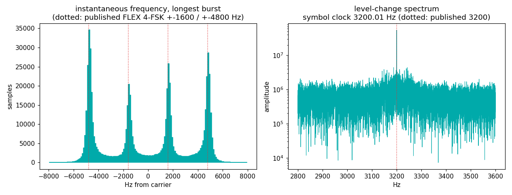
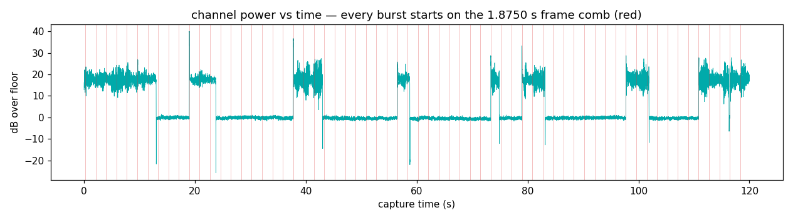

# FLEX — the pager grid that ticks every 1.875 seconds

Motorola's FLEX protocol (1993) still owns the 929/931 MHz paging
band, because hospitals never stopped needing messages that arrive
through six floors of concrete. Its grid is built for receivers that
sleep: time is chopped into a **4-minute cycle of 128 frames, each
exactly 1.875 s**, and a pager wakes only for its assigned frames.
The transmitter's discipline is absolute — it may skip frames with no
traffic, but it may never start off-grid.

## The grid

| element | value | why |
|---|---|---|
| Frame period | **1.875 s** = 240 s / 128 | pagers sleep between assigned frames — weeks on a AA battery |
| Cycle | 128 frames, GPS-disciplined to the wall clock | every transmitter in a simulcast network fires in lockstep |
| Frame layout | sync + frame info word + 11 blocks | sync is always sent robust, data speed can vary per frame |
| Speeds | 1600 / 3200 bps (2-FSK), 3200 / 6400 bps (4-FSK) | |
| 4-FSK deviations | **±4800 Hz** (outer), **±1600 Hz** (inner) | 2 bits/symbol at 3200 sym/s = 6400 bps |
| Symbol clock | **3200 sym/s** at top speed | |

## What we measured (929 MHz paging band, rabbit ears, Virginia)

120 s at 1 MS/s. We went in hunting **POCSAG** — the older pager grid,
2400 Bd 2-FSK, sync word `0x7CD215D8` every 544-bit batch — and the
band said no:

```
channel offset from dial: +732 Hz
9 bursts; starts [0.0, 18.97, 37.72, 56.47, 73.35, 78.97, ...]
frame comb: best period 1.8750 s (R = 1.000) — published 1.8750 s
  burst spacings / 1.875: [10.117, 10.0, 10.0, 9.0, 3.0, 10.0, 7.0, 3.0]
FSK lobes (Hz, carrier removed): [-4749, -1550, +1650, +4850]
  4-FSK deviation: outer +-4800 Hz (published 4800),
                   inner +-1600 Hz (published 1600)
symbol clock: 3200.01 Hz (+40.5 dB) — published 3200 sym/s
POCSAG sync control: 0 hits in 9 bursts
```

| constant | published (FLEX) | measured |
|---|---|---|
| frame period | 1.8750 s | 1.8750 s, phase coherence R = 1.000 over 8 burst starts |
| burst spacings | integer frames | 10, 10, 9, 3, 10, 7, 3 × 1.875 s (one outlier: a burst whose first frames were below our detector) |
| 4-FSK outer deviation | ±4800 Hz | ±4800 Hz |
| 4-FSK inner deviation | ±1600 Hz | ±1600 Hz |
| symbol rate | 3200 sym/s | 3200.01 Hz, +40.5 dB line |
| POCSAG sync 0x7CD215D8 | absent if FLEX | 0 hits (28/32-bit threshold, both polarities) |



Four clean lobes standing exactly on ±1600 / ±4800, and a symbol-clock
line at 3200.01 Hz — the two fingerprints that identify 6400 bps
4-FSK FLEX without decoding a single address.



Every burst in two minutes starts on the same 1.875 s comb. Silence
between bursts is just frames nobody paged in; the grid never moves.

Honesty notes:

- **We did not decode FLEX** (no BCH, no address parsing). The
  identification rests on three independent constants landing on the
  published values, plus the POCSAG negative control.
- The wrong hypothesis fought back: an early sign-sliced "baud
  search" restricted to a 2300–2500 Hz window found a razor-sharp
  line at 2400.000 Hz and we nearly called it POCSAG. Binary-slicing
  a 4-FSK signal manufactures phantom clocks; the unrestricted
  level-change spectrum (right panel) shows where the real clock is.
  Never hand a measurement a window that assumes the answer.
- Bursts appear on several channels in this band; the script
  auto-selects the busiest. Others may run different FLEX speeds —
  or actual POCSAG, elsewhere.

## Reproduce it

```
python measure.py --iq your_capture.cs16 --fs 1000000
```
Tune the middle of your local 929–932 MHz paging allocation (int16
interleaved IQ), a few minutes, any antenna — paging transmitters are
tens of kilowatts of ERP built to punch into basements. If your burst
starts fold at 1.875 s, you've found FLEX's heartbeat.
