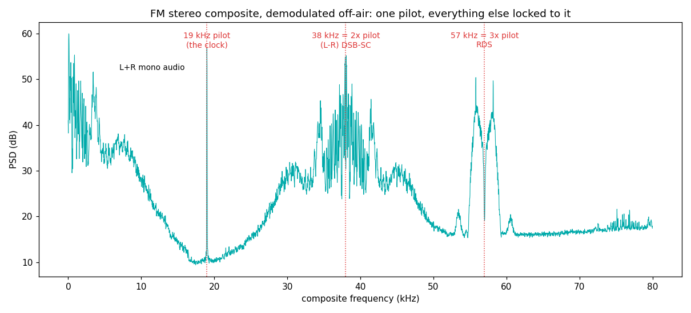

# FM stereo composite — the oldest grid still on the air (1961)

## The grid

| parameter | value | why |
|---|---|---|
| Pilot tone | **19,000 Hz ± 2 Hz** | the master clock the whole composite hangs off |
| Mono audio (L+R) | 0 – 15 kHz | every receiver, mono or stereo, hears this |
| Stereo difference (L−R) | DSB-SC on **38 kHz = 2× pilot** | suppressed carrier — regenerated by *doubling the pilot's phase* |
| RDS data | BPSK on **57 kHz = 3× pilot**, 1187.5 bps | see the [rds](../rds/) entry |
| Deviation budget | ±75 kHz total; pilot gets 8–10% | pilot must be findable at any program loudness |
| De-emphasis | 75 µs (US) | FM noise rises as f² — treble is pre-boosted at the TX, cut at the RX, and the noise parabola's top goes with it |

The design is genius-by-constraint: in 1961 stereo had to be invisible
to existing mono radios. So (L+R) stays where mono receivers expect
audio, and (L−R) hides above 23 kHz. A stereo receiver reconstructs
L = (M+S), R = (M−S). The suppressed 38 kHz carrier is recovered *for
free*: square a unit phasor locked to the 19 kHz pilot and its phase
doubles — an exact, PLL-free 38 kHz reference that even tracks your
tuner's frequency error.

## What we measured (WFLS 93.3 MHz, suburban Virginia, RSPdx + rabbit ears)

```
pilot:          18996.3 Hz   (+45.9 dB above guard-band floor)
38k region:     37997.0 Hz   = 2.0002 x pilot   (grid says 2)
57k RDS:        56861.4 Hz   = 2.9933 x pilot   (grid says 3)
L-R energy:   Re branch -28.9 dB rel M | Im branch -6.2 dB rel M
```



Notes from the lab:

- The pilot reads 18,996 Hz, not 19,000 — that's *our* SDR's sample
  clock ppm error, not the station's (broadcast pilots hold ±2 Hz).
  The *ratios* are exact because all three elements share the ppm.
- The subcarriers are **bands, not tones** (the carriers are
  suppressed) — a naive peak-pick lands on whichever sideband is loud
  at that moment; `measure.py` uses the band power centroid.
- **The 90° trap**: whether (L−R) appears in the real or imaginary
  branch of `composite × conj(pilot²)` depends on the sin/cos phase
  convention between pilot and subcarrier. Get it wrong and stereo
  silently vanishes while every other meter reads perfect. Measure it
  (−6.2 dB of coherent stereo in Im vs −28.9 dB of residue in Re
  above) instead of trusting a diagram.

## How this grid becomes a receiver

The pilot SNR is a live quality dial: stereo demodulation folds in
~16 dB more noise than mono (the L−R band sits high on FM's f² noise
parabola), so a good receiver *blends* toward mono as pilot SNR falls.
Full derivation and the working demod: gr-radiotuna's
[SCIENCE.md](https://github.com/Felbs/gr-radiotuna/blob/master/docs/SCIENCE.md)
and `tools/fm_stereo.py`.

## Reproduce it

```
python measure.py --iq your_capture.cs16 --fs 2976750
```
Any IQ capture centered on a stereo FM station, ≥500 kHz rate,
interleaved int16.
