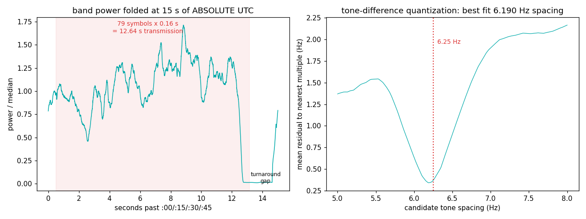

# FT8 — the grid that is the clock on the wall

FT8 is the most-transmitted digital mode in amateur radio. Its deepest
design idea: **the synchronization grid is UTC itself.** Nobody
transmits a sync preamble for you — every station on Earth starts
exactly on the 15-second wall-clock boundaries, trusting that your
clock and theirs both trace to GPS/NTP. The band breathes in unison.

## The grid

| parameter | value | why |
|---|---|---|
| Slot | **15 s, aligned to UTC :00/:15/:30/:45** | half the stations transmit on even slots, half on odd — a planet-wide TDMA |
| Transmission | 79 symbols × 0.16 s = **12.64 s**, starting 0.5 s into the slot | the remaining ~1.9 s covers decode + turnaround |
| Modulation | 8-GFSK, **tone spacing 6.25 Hz = symbol rate** | orthogonal FSK: spacing == baud, the minimum that keeps tones orthogonal |
| Sync | 3 × 7-symbol Costas arrays inside each transmission | fine time/frequency alignment after the wall clock gets you close |
| FEC | LDPC(174,91) + CRC-14 | decodes at −21 dB SNR in 2.5 kHz |
| Band plan | everyone shares ~3 kHz of USB audio above the dial (7.074 MHz on 40 m) | dozens of simultaneous QSOs, each ~50 Hz wide |

## What we measured (40 m, 8:36 PM EDT, roof discone, Virginia)

```
capture starts 00:36:45.541Z = 0.541 s into a UTC 15 s slot
UTC-folded band power: on/off contrast 6.8 dB at the wall-clock grid
symbol-synchronized tones: spacing quantizes at 6.19 Hz
                           (residual 0.34 Hz; grid says 6.25)
```



The left panel is the point of this entry: fold three minutes of band
power at 15 s of **absolute UTC** — using nothing but our PC's NTP
clock and the capture timestamp — and the whole band's on/off duty
snaps into view: transmissions on, turnaround gap off, 6.8 dB of
contrast. We never decoded a bit. The grid was never transmitted. It
was *agreed upon*.

## What didn't work (and why that's the lesson)

Two estimators failed before one worked, and the failures are the
education:

1. **Transition-spectrum baud measurement read 5.7 Bd** — GFSK's
   Gaussian pulse shaping smooths symbol transitions *by design*, so
   transition energy reads low. Good for spectral politeness, bad for
   naive clock estimators.
2. **Spectrum autocorrelation found no 6.25 Hz comb** — in a long FFT
   the tone lines simply don't exist; Gaussian shaping smears each
   ~50 Hz signal into a smooth lump. The comb you expect from the
   textbook FSK picture is a property of *unshaped* FSK.
3. **What worked: symbol-synchronized analysis** — FFT each 0.16 s
   symbol individually (timed off the UTC grid proved in step one),
   peak-pick one tone per symbol, and check that pairwise tone
   differences quantize on a common spacing: 6.19 Hz, within the
   resolution of a 0.12 s window plus NTP timing slop. The tones only
   exist one at a time — so you must look one symbol at a time.

Full decoding belongs to WSJT-X (the reference implementation whose
authors designed the mode). This entry measures the skeleton it hangs
on.

## Reproduce it

```
python measure.py --iq your_capture.cs16 --fs 250000
```
Tune 7.074 MHz (40 m, best evenings/nights) or 14.074 (20 m, daytime),
capture ≥3 minutes, and record the capture start time (UTC, sub-second)
in the sidecar — the wall clock IS the measurement.
