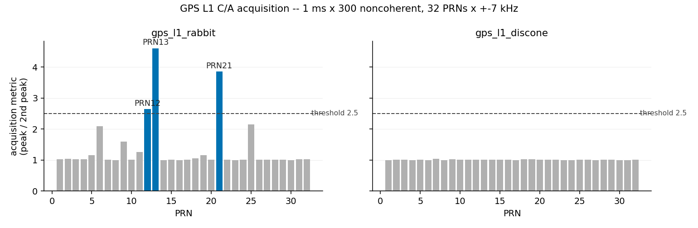
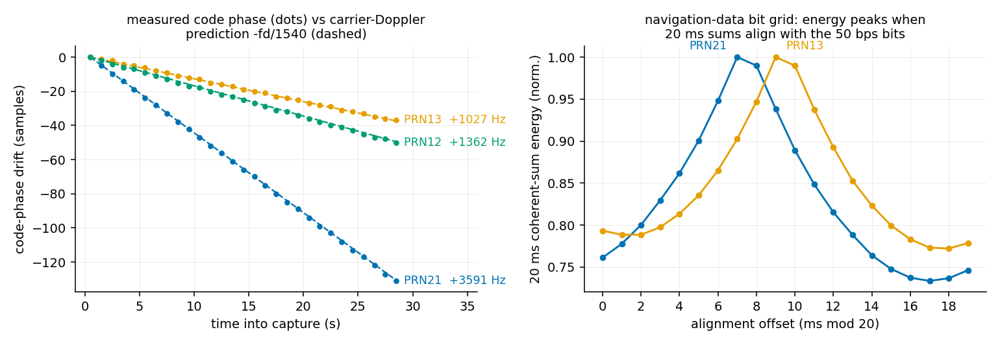

# GPS L1 C/A — the grid that lives 20 dB below the noise

Every other entry in this atlas started with a signal you could at
least *see*. GPS you cannot. An L1 satellite delivers about
-130 dBm to an antenna on the ground — roughly **20 dB under the
thermal noise floor** of its own 2 MHz channel. No spectrum display
will ever show it. The signal is findable only because its grid is
promised in advance with atomic-clock discipline: each satellite
spreads a 50 bps message with its own **1023-chip Gold code at
exactly 1.023 Mchip/s** — one code epoch per millisecond — and the
code clock and the carrier are the *same oscillator*, 1540 carrier
half-cycles per chip apart. Correlate against the known code and
1 ms of noise collapses into a single chip-wide spike: 30 dB of
processing gain, bought entirely by knowing the grid.

We pointed two antennas that have no business receiving L-band —
TV rabbit ears and a roof discone — at 1575.42 MHz, with no LNA and
no filtering, expecting an honest failure.

## The grid

| element | value | why |
|---|---|---|
| Carrier | 1575.42 MHz = 1540 × 1.023 MHz | code and carrier from one atomic standard — measure one, predict the other |
| Spreading code | 1023-chip Gold code, one per SV (32 PRNs) | cross-correlation ≤ -24 dB lets 12 satellites share one frequency (CDMA) |
| Chip rate | **1.023 Mchip/s**, epoch exactly 1.000 ms | the ranging ruler: 1 chip ≈ 293 m |
| Code generator | G1: x¹⁰+x³+1, G2: x¹⁰+x⁹+x⁸+x⁶+x³+x²+1, per-PRN G2 tap pairs | published in IS-GPS-200 with per-PRN check octals |
| Nav data | **50 bps**, 20 ms per bit, edges locked to code epochs | slow enough to survive 20 dB under the noise |
| Processing gain | 10·log₁₀(1023) ≈ **30.1 dB** per 1 ms coherent | plus ~5·log₁₀(N) for N noncoherent stacks |
| Doppler window | ±4.2 kHz from SV motion (+ receiver TCXO error) | 12-hour MEO orbits, ~3.9 km/s |

## What we measured (1575.42 MHz, rabbit ears vs roof discone, Virginia)

Two 30 s captures at 2.048 MS/s, RSPdx with AGC, morning of
2026-07-20. House law first: the C/A generator had to reproduce the
published IS-GPS-200 first-10-chip octals (a generator bug validates
itself circularly otherwise), and the whole acquisition chain had to
find a synthetic satellite buried at -20 dB SNR before touching real
data (`--selftest`). It did: metric 7.12, correct PRN, Doppler and
code phase.

Then the real thing — **the $12 rabbit ears heard four GPS
satellites**:

```
capture: gps_l1_rabbit.cs16
  acquisition 1 ms x 300, +-7 kHz / 250 Hz, threshold 2.5:
    PRN13  metric 4.60  Doppler +1000 Hz  code phase 780 samp   DETECTED
    PRN21  metric 3.85  Doppler +3500 Hz  code phase 911 samp   DETECTED
    PRN12  metric 2.64  Doppler +1500 Hz  code phase 549 samp   DETECTED

capture 2: gps_l1_discone.cs16
    no PRN above threshold (best 1.04)

PRN21 track over 30 s:
  carrier Doppler +3590.7 Hz (std 5.0)   C/N0 ~37.3 dB-Hz
  code-phase drift -4.684 samp/s, carrier predicts -4.668 (-fd/1540):
    ratio 1.004, fit rms 0.28 samp
  C/A epoch 0.999997713 ms, carrier predicts 0.999997721 ms (diff 8.0 ps)

PRN21 nav-bit alignment (20 ms blocks over 10 s):
  tent peak at 7 ms, max/min 1.36 -- 50 bps bit grid FOUND

TLE check (12 SVs above horizon): [4, 5, 6, 9, 11, 12, 13, 17, 19, 21, 22, 25]
  common receiver clock offset +1243 Hz (+0.789 ppm of the LO)
  PRN12 el +48.4  meas +1361.6 Hz  TLE   +156  resid   -37 Hz
  PRN13 el +45.0  meas +1027.5 Hz  TLE   -177  resid   -39 Hz
  PRN21 el +55.1  meas +3590.7 Hz  TLE  +2271  resid   +76 Hz
  sub-threshold PRNs whose best acquisition cell lands on the
  TLE-predicted Doppler (chance: ~1 in 19 each):
    PRN 5 el +21.7  cell  +5000 Hz  predicted  +4888  (metric 1.16)
    PRN 6 el +49.8  cell   -500 Hz  predicted   -525  (metric 2.09)
    PRN 9 el +22.2  cell  +2000 Hz  predicted  +2032  (metric 1.60)
    PRN11 el +68.5  cell  +1500 Hz  predicted  +1474  (metric 1.27)
    PRN19 el +47.7  cell   -750 Hz  predicted   -668  (metric 1.16)
    PRN25 el +22.4  cell  +3250 Hz  predicted  +3200  (metric 2.15)
```

A fourth satellite, PRN6, sat just under the acquisition threshold
but tracked cleanly for 30 s once we knew where to look: fine
Doppler -438.8 Hz (17 Hz from the TLE prediction after the common
clock offset), code drift +0.554 samp/s vs +0.570 predicted, epoch
1.000000271 ms vs 1.000000279 ms predicted.

| constant | published | measured |
|---|---|---|
| C/A generator, first 10 chips | PRN1 `1440`, PRN2 `1620`, PRN3 `1710`, PRN4 `1744`, PRN5 `1133` (octal) | identical, all five |
| code epoch | 1.000 ms × (1 + f_d/f_L1) | 0.999997713 ms (PRN21) — 8 ps from the carrier's prediction |
| code/carrier lock ratio | code drift = -f_d/1540 | ratio 1.004–1.006 across 3 SVs, fit rms 0.3 samples over 30 s |
| nav-data bit period | 20 ms (50 bps) | alignment-energy tent peaks with 20 ms period, max/min 1.36 |
| constellation | 12 SVs above horizon (TLE) | 3 detected + 1 tracked sub-threshold + 5 more corroborated by Doppler cell |
| Doppler vs TLE | SGP4 prediction | residuals -39…+76 Hz after one common clock offset (+0.79 ppm TCXO) |



Left: three PRNs stand clear of the 2.5 detection threshold on the
rabbit ears, and the "grass" at PRN 6, 9, 11, 25 turns out to be real
satellites too — each of those cells sits on its TLE-predicted
Doppler. Right: the roof discone heard nothing at all — 32 flat bars
of honest noise.



Left: thirty seconds of code-phase measurements (dots) against the
slope the carrier Doppler *demands* via the 1540 ratio (dashed) —
three satellites, three different Dopplers, all on their rails
within 0.3 samples rms. This is the atomic-clock coherence of the
grid, visible from a living room. Right: coherently summing prompts
in 20 ms blocks peaks exactly when the blocks align with the 50 bps
navigation bits — a triangular tent with the promised 20 ms period.

Honesty notes:

- **We did not decode the navigation message** — no preamble hunt,
  no ephemeris, and (deliberately) no position fix. Identification
  rests on: the Gold-code correlation spike, the code/carrier 1540
  lock, the 20 ms bit tent, and per-SV Doppler matching an
  independent orbit model to tens of Hz.
- **The discone's zero is not purely an antenna verdict.** That run
  arrives through a long roof coax feed, and at 1575 MHz the coax
  eats what the antenna's VHF-optimized geometry didn't already
  lose. Antenna-limited *and* plumbing-limited; we can't separate
  the two from this capture.
- Synthetic calibration puts this pipeline's floor (1 ms × 300
  noncoherent) at **~34–35 dB-Hz**; a clear-sky GPS patch antenna
  sees 44–50 dB-Hz. The rabbit ears delivered 34–37 dB-Hz — we were
  living within ~2 dB of the cliff, which is exactly why five more
  satellites show up only as Doppler-corroborated grass.
- C/N0 figures are approximate (±2 dB): nearest-chip code sampling,
  250 Hz Doppler bins, and a median-based noise floor each shave or
  pad a little. AGC makes absolute power meaningless; only ratios
  survive.
- The TLE snapshot (`gps_ops_20260720.tle`) was fetched from
  CelesTrak the same day; SGP4 Doppler for GPS is only good to a few
  tens of Hz, which is most of the residual.
- The observer point used for the TLE check is a deliberately coarse
  regional grid point — elevations and Dopplers move less than the
  TLE error over ~100 km, and this entry never states or derives
  where the antenna actually is.

## Reproduce it

```
python measure.py --selftest                       # prove the pipeline first
python measure.py --iq your_l1.cs16 --fs 2048000 \
       [--iq2 other_antenna.cs16] \
       [--tle gps_ops.tle --t0 2026-07-20T12:14:27Z --lat 38 --lon -78.5]
```

Tune 1575.42 MHz, 2.048 MS/s, 30 s, AGC on, int16 interleaved IQ.
Any antenna with any sky view is worth trying — the entire detection
lives in the correlator, not the hardware. If your bars clear 2.5,
check the code-phase drift against -f_d/1540: if they agree, you are
watching an atomic clock in a 20,000 km orbit through a TV antenna.

## Addendum: reading the clock

This morning's honesty note said we did not decode the navigation
message. That afternoon, on a fresh 120 s rabbit-ears capture, we did.

A closed-loop tracker (half-chip DLL + Costas PLL, 1 ms prompts) held
PRN 15 phase-locked for the full 118 s at ~37 dB-Hz. The 20 ms bit
tent from the morning became exact: 100% of sign transitions land on
one epoch boundary mod 20, and majority-voting each 20-epoch block
produced **5,874 bits with zero 1 ms epochs dissenting** from their
bit. In that stream the 8-bit TLM preamble `10001011` repeats every
300 bits, and all 180 words of 18 consecutive subframes pass the
IS-GPS-200 D29*/D30* parity chain (checker validated on a synthetic
stream first — roundtrip, polarity flip, 100/100 single-bit errors).

The HOW of the first subframe reads TOW 24406: this subframe began at
second 146,430 of GPS week — Monday 16:40:30 GPS, 16:40:12 UTC after
the 18 leap seconds. Subframe 1's week field says **380** — ten bits,
so the receiver adds 2×1024 rollovers from context to get week 2428.
Trust the field alone and today is 1987; that is the exact bug our
AIS entry caught in a receiver living 1024 weeks in the past.

Cross-check: the capture's own timestamp puts that subframe's arrival
702.6 ms *before* broadcast — impossible, light doesn't run backwards.
Two weaker satellites (PRN 5 and 23, ~26 dB-Hz, parity-clean through
their own bit errors) land at −695.6 and −692.4 ms: a common bias with
a ~10 ms spread. The spread is real differential satellite range; the
bias means our recorder's "±tens of ms" sidecar stamp is actually
~0.77 s early. Three atomic clocks in orbit, one vote: the satellites
audit the ground station, never the other way around. No position was
computed — we read the grid's time, and that is all.
