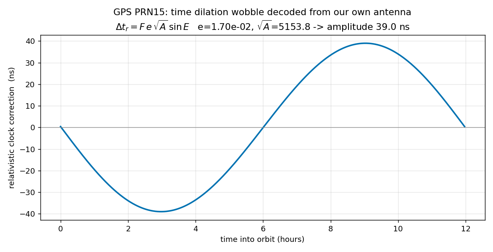

# Einstein, decoded from a 120-second GPS capture

Pipeline: acquire/track PRN -> 1 ms prompts -> carrier cleanup -> 50 bps
nav bits -> preamble+parity frame sync -> ephemeris -> relativity.

```
PRN15 DECODED EPHEMERIS (from OUR antenna's bits):
  eccentricity e        = 1.703157e-02
  sqrt(A)               = 5153.750330 sqrt(m)  ->  a = 26,561.1 km
  orbital period        = 11.967 h (should be ~11.97 h)
  clock af0/af1/af2     = 4.299e-04 s, 3.070e-12, 0.000e+00

RELATIVISTIC ECCENTRICITY WOBBLE  dt_r = F*e*sqrtA*sin(E):
  amplitude = 39.00 ns  (peak-to-peak 77.99 ns each orbit)
  = the satellite clock visibly speeds up/slows down as its
    altitude+speed change around the ellipse. Receivers MUST
    apply this correction; the parameters came from our own decode.

SR + GR CLOCK BUDGET (from the DECODED semi-major axis):
  special relativity (speed 3,874 m/s): -8.3487e-11  (-7.21 us/day SLOW)
  general relativity (altitude):                    +5.2958e-10  (+45.76 us/day FAST)
  net predicted offset:                             +4.4609e-10
  GPS factory clock detune (IS-GPS-200):            -4.4647e-10
  agreement: -99.9% of the designed value

WITHOUT EINSTEIN: clocks drift +38.5 us/day ->
  ranging error 11.6 km/day. Maps dead by lunch.
```


