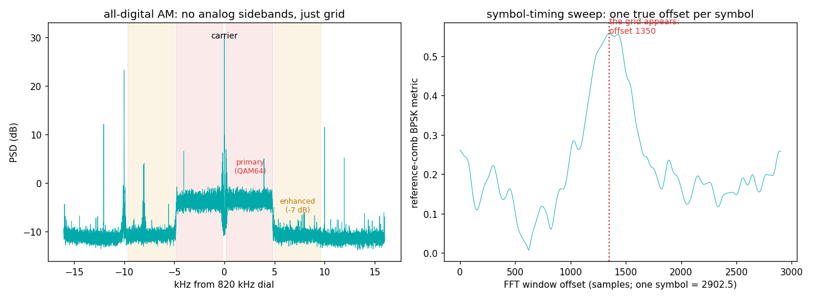
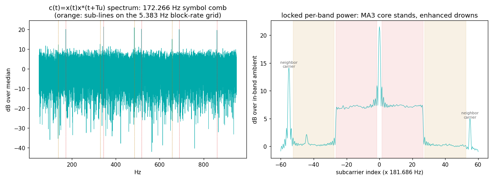

# HD Radio on AM (NRSC-5 all-digital MA3) — the grid that ate a broadcast band's oldest waveform

On 820 kHz, where a century of AM radio would put audible sidebands,
WWFD (Frederick, Maryland — the US pioneer of all-digital AM) transmits
**no analog program at all**: just its carrier and a ±5 kHz block of
OFDM. Same NRSC-5 family as FM HD Radio, same elemental clock, every
constant divided down to squeeze through a channel 20× narrower.

## The grid

Everything divides down from the same **744,187.5 Hz** clock the FM
grid uses (see `../nrsc5-fm-hybrid/`), stepped down 16× to a
**46,511.71875 Hz** native rate:

| parameter | value | why |
|---|---|---|
| FFT (useful symbol) | **256** samples | 256 subcarriers max |
| Subcarrier spacing | 46,511.71875 / 256 = **181.686 Hz** | exactly half the FM spacing — halved for AM's narrow channel |
| Guard interval | **14** samples — raised-sine tapered, overlap-added | same 7/128 ratio as FM's 112/2048 |
| Total symbol | **270** samples → **172.265625 sym/s** | 5.805 ms |
| MA3 layout | carrier at 0, **BPSK refs at ±1**, QAM64 primary ±2…26, PIDS ±27, reduced-power "enhanced" ±28…52 | edge at ±9.63 kHz |
| Block | **32 symbols = 185.76 ms**, sync word on the refs each block | receiver's foothold |
| L1 frame | 8 blocks = 256 symbols = **1.48607 s** | |
| Service mode | **psmi field in the ref bits: 1 = MA1 hybrid, 2 = MA3 all-digital** | the broadcast labels itself |

(Constants and the 32-bit block-sync word cross-read from the nrsc5
source — `FFT_AM`, `CP_AM`, `find_block_am()`.)

## What we measured (WWFD 820 kHz, RSPdx + roof discone, Virginia, 60 s, summer evening)

```
carrier line: +1.13 Hz from dial
OFDM pedestal +7.1 dB over floor; edges +4836 / -4833 Hz
MA1 primary region 10.5-14.5 kHz: -0.2 dB -> no hybrid shelves (not MA1)
Tu = 5.4891 ms -> 1/Tu = 182.2 Hz          (published 5.5040 ms / 181.686 Hz)
symbol-rate comb: 172.2659 Hz over 5 harmonics  (published 172.265625; +1.5 ppm)
  sub-lines at 61.00 / 90.00 / 122.00 x the 5.3833 Hz block rate
grid-snapped spacing = SR x 270/256 = 181.6867 Hz  (published 181.6864)
timing sweep: lock metric 0.56 vs sweep median 0.18
block sync word: hit rate 0.90 over 311 blocks
block counter: 7,0,1,2,3,4,5,6,7,0,... -> L1 frame 1.4861 s
psmi: {2: 38, 18: 1}   -> MA3, all-digital, 38 of 39 frames (one bit flip)
```

| constant | published | measured |
|---|---|---|
| subcarrier spacing | 181.6864 Hz | 181.6867 Hz (+1.5 ppm; symbol comb × 270/256) |
| useful symbol Tu | 5.5040 ms | 5.489 ms (CP autocorr; broad ridge, ±0.3 %) |
| symbol rate | 172.265625 Hz | 172.2659 Hz, 5-harmonic fit, residual ~1 mHz |
| block period | 185.759 ms | 32-symbol sync word @ hit rate 0.90; blind sub-lines at 61/90/122 × 5.3833 Hz |
| L1 frame | 1.48607 s | block counter cycles 0…7 → 1.4861 s |
| service mode | MA3 = psmi 2 | **psmi 2 in 38/39 frames** |
| analog program | none in MA3 | none seen — flat OFDM shelf, no audio sidebands, no MA1 shelves |



Left: a carrier with **no analog sidebands** — just a flat ±4.8 kHz
OFDM pedestal 7 dB over the evening band noise (the spikes nearby are
ordinary analog neighbors 10 kHz away). Right: sweep the FFT window
across one symbol and score how ±real the ±181.7 Hz reference
subcarriers' symbol-to-symbol products are — the grid appears at one
offset per symbol.



Left: the money plot. At lag Tu, c(t) = x(t)·x*(t+Tu) turns periodic:
a line comb at exactly 172.266 Hz and its harmonics, with fainter
sub-lines on the 5.383 Hz **block**-rate grid — the 32-symbol block
structure visible without decoding a bit. Right: locked per-band
power — carrier, the two reference towers at ±1, the QAM64 primary
shelf out to ±26, and (labeled) the neighbors' carriers sitting
off-grid at index ±55.04.

## What this capture taught us

1. **Notch the carrier before you sweep.** The carrier is ~35 dB above
   any subcarrier; with even 1 Hz of CFO its leakage into the ±1 bins
   fakes BPSK coherence at *every* window offset. Our lock wandered and
   occasionally jumped 85 samples until the notch went in.
2. **Phase restarts per symbol — the FM law in a new disguise.**
   Squaring a BPSK reference normally yields a clean line at 2f. Not
   here: each OFDM symbol restarts phase, so the squared ref smears
   into a comb offset by the guard fraction. We chased that ghost for
   one round of synthetics.
3. **A window can dodge junk, or a test can reject it — only one is
   honest.** With the Tu search bounded by physics alone (2.5–10 ms), a
   co-channel analog station's program audio put a *bigger*
   autocorrelation peak at 2.63 ms than the guard did at 5.49 ms
   (two extra carrier lines hide near the dial — evening skywave
   company). We kept the wide window and let the comb decide: only the
   true Tu makes c(t) periodic (5 harmonics, 101 dB of line); the
   phantom lag mustered one stray line.
4. **A reference decoder can be deafer than a measurement.** nrsc5
   (`--am`) syncs instantly on our synthetic MA3 — confirming the whole
   grid model, psmi bits included — but never syncs this off-air file
   in any variant. Coherent averaging over 10,000 symbols hears a grid
   that a symbol-by-symbol receiver cannot. A referee's silence is not
   evidence of absence. (Also: nrsc5's IQ-file input expects the
   spectrally *inverted* sense — feed it the conjugate.)

Honesty notes:

- **We did not decode audio.** The identification rests on five
  independent constants landing on published values plus the
  broadcast's own psmi = 2 field, read from the reference subcarriers.
- **The enhanced partitions (±28…52) are not claimed.** Spec puts them
  ~15 dB below primary; here that is at/below the ambient (+0.2 dB
  band excess). Every clever detector failed honestly: the PSD comb is
  invisible at 256/270 = 94.8 % occupancy, and a band-limited c(t)
  comb test lit up in a *control band with no subcarriers at all* —
  OFDM symbol-edge splatter is periodic too. Verdicts need negative
  controls.
- Tu from the guard autocorrelation is the weakest number (broad,
  biased ridge; the guard is tapered, so the classic CP ridge barely
  exists — the FM entry's law #1). It serves as the cross-check that
  the precise symbol comb sits at the right *place*; the precision
  lives in the comb.

## Reproduce it

```
python measure.py --iq your_capture.cs16 --fs 500000
```

60+ s at 500 kS/s (int16 I/Q) centered on an HD-AM station. All-digital
stations are rare — WWFD 820 is the famous one; hybrids (MA1) put the
same grid at ±10.4…14.7 kHz beside the analog program, which this
script will flag via the shelf test. numpy + matplotlib only.
