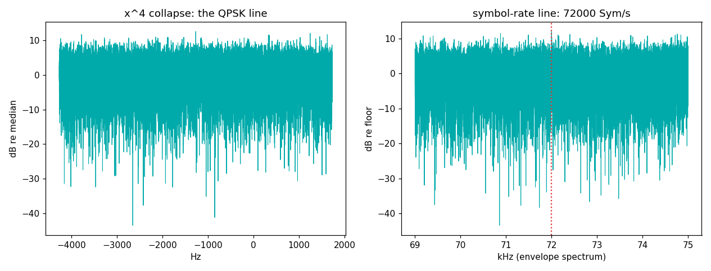

# Meteor-M LRPT — a weather satellite's grid, measured from a backyard

Meteor-M satellites transmit Low-Rate Picture Transmission on ~137.1 /
137.9125 MHz: live weather imagery, receivable during any decent pass
with a $30 antenna.

## The grid

| parameter | value | why |
|---|---|---|
| Modulation | QPSK, root-raised cosine | 2 bits/symbol in ~140 kHz |
| Symbol rate | **72,000 Sym/s** (80k in some modes) | |
| Inner FEC | convolutional K=7, r=1/2 (Viterbi) | the classic CCSDS pair... |
| Framing | CADUs behind the 32-bit ASM **0x1ACFFC1D** | ...the most famous sync word in spaceflight |
| Outer FEC | RS(255,223), interleave 4 | |
| Payload | MSU-MR imager, JPEG-ish blocks | the actual pictures |

## What we measured (Meteor-M N2-x pass, 2026-07-18, RSPdx + discone)

```
x^4 spectrum: strongest line +12.5 dB at -1271.7 Hz
              -> QPSK confirmed, carrier offset -317.9 Hz (Doppler-scale)
symbol clock:  72000.0 Sym/s (+12.0 dB line; grid says 72000)
```



Two classic blind measurements:

- **The ×4 collapse.** Raise a unit-magnitude QPSK signal to the 4th
  power and its modulation cancels — the spectrum collapses to a
  single line at 4× the residual carrier offset. (BPSK collapses at
  ×2, 8-PSK at ×8; noise never collapses.) Our line sits at −1272 Hz →
  carrier −318 Hz, comfortably inside LEO Doppler.
- **The baud line.** The squared envelope of any linearly-modulated
  signal carries a spectral line at exactly the symbol rate. Ours
  reads 72,000.0.

**Bound your searches with physics.** This script's first run hunted
lines over the whole spectrum and confidently reported a "carrier"
20.7 kHz off — six times outside what Doppler allows at 137 MHz. The
constraint (±3.5 kHz Doppler → ×4 line within ±14 kHz) is part of the
measurement, not an afterthought.

## Deeper layers

Viterbi, ASM hunting, de-interleaving, and RS(255,223) are *decoding*
rather than measuring — the full chain (validated all the way to
pictures) lives in [wxTuna](https://github.com/Felbs/wxTuna)
(`tools/lrpt.py`). Fun symmetry: the same Viterbi+RS pair we wrote for
LRPT turned out to be the exact FEC the RS41 radiosonde needed — see
[rs41-radiosonde](../rs41-radiosonde/) — CCSDS heritage gets around.

## Reproduce it

```
python measure.py --iq pass.cs16 --fs 250000 --t-start 300
```
Record a Meteor pass at 137.1/137.9125 MHz, 250 kS/s (pass predictions
from any tracker; aim for >30° elevation).
