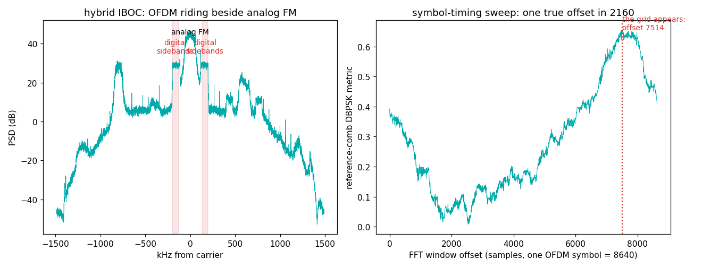

# HD Radio (NRSC-5 FM hybrid IBOC) — an OFDM grid hiding beside analog FM

## The grid

Everything divides down from one elemental clock, **744,187.5 Hz**
(= 135,408 × 44,100 / 8,192 — yes, it's tied to the audio rate):

| parameter | value | why |
|---|---|---|
| FFT (useful symbol) | **2048** samples | 2048 subcarriers max |
| Subcarrier spacing | 744,187.5 / 2048 = **363.373 Hz** | |
| Guard interval | **112** samples — **raised-sine tapered, overlap-added** | NOT a plain cyclic prefix! Tapering cuts spectral splatter into the analog host |
| Total symbol | **2160** samples → **344.53 sym/s** | 2.9022 ms |
| Active subcarriers (hybrid MP1) | ±356 … ±546 (= ±129.4 to ±198.4 kHz) | the middle is left for the analog FM station it rides beside |
| Partitions | 19 subcarriers each (18 data + 1 reference), 10 per sideband | |
| Reference subcarriers | **every 19th: ±(356, 375, … 546)** — 22 total | DBPSK, known 32-bit word per L1 block: the receiver's training wheels |
| L1 frame | 512 symbols = 1.486 s | |

## What we measured (WFLS 93.3 MHz, RSPdx + discone)

```
digital sideband shelves: +23.2 dB above the floor at +-130..195 kHz
symbol-timing sweep: lock spike at offset 7514/8640 (metric 0.657;
                     sweep median 0.258 = the floor)
```



Left: the hybrid spectrum — an analog FM station with two OFDM shelves
bolted onto its shoulders. Right: the money plot. Sweep the FFT window
offset across one full symbol and score how "±real" the differential
products on the reference comb are: at exactly one offset in 8640, the
grid *appears*. That spike is the receiver's foothold for everything
else (equalization, MER dials, decoding).

## Three laws this grid taught us (each cost an afternoon)

1. **Don't autocorrelate the guard.** Textbook OFDM sync correlates
   the cyclic prefix against the symbol tail. NRSC-5's guard is
   *tapered and overlap-added* — the classic ridge barely exists. The
   reference-subcarrier comb is the real hook.
2. **Symbols restart phase.** Each OFDM symbol is an independent
   cyclic block. There is *no* guard-stride rotation to compensate on
   the differential products — "correcting" for one scrambles every
   reference by a constant angle and buries the lock. The only
   systematic rotation is the common one from residual CFO: estimate
   it blindly as ½·arg(Σd²) and remove it.
3. **The comb only exists in the sidebands.** In hybrid mode the
   center of the channel is the *analog* station. A reference comb
   spanning the full ±546 reads mostly FM hum and scores noise. (This
   very script shipped with that bug for twenty minutes.)

Also: the reference carriers are **not power-boosted** — you cannot
see the comb in a PSD. Only their modulation betrays them. And our
derived CFO matched the reference decoder (nrsc5) to the Hz on the
same capture — always cross-check against a referee when one exists.

## Reproduce it

```
python measure.py --iq your_capture.cs16 --fs 2976750
```
Capture an HD station at exactly 2,976,750 S/s (4× native), 20+ s.
Full lock/equalizer/per-subcarrier-MER tooling lives in
[albacore](https://github.com/Felbs/albacore) (`lab/hd_ref_lock.py`).
