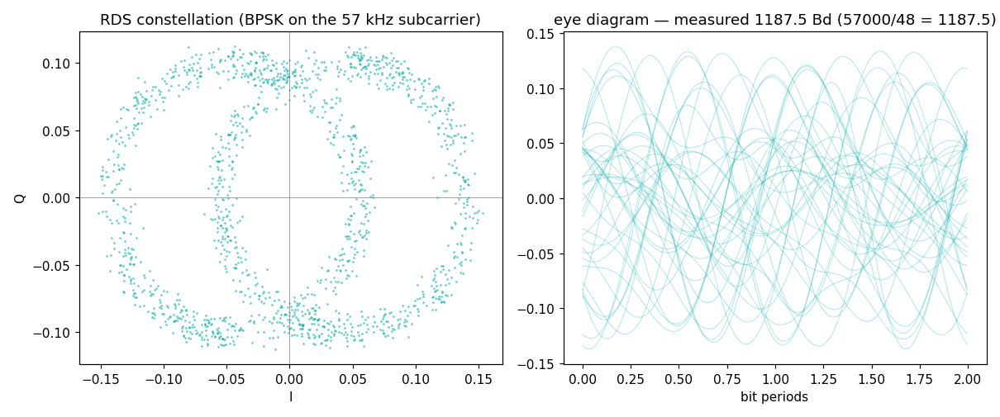

# RDS — the data grid hiding inside every FM station

## The grid

| parameter | value | why |
|---|---|---|
| Subcarrier | **57 kHz = 3× the 19 kHz pilot** | regenerated free from the pilot, sits in a quiet part of the composite |
| Modulation | BPSK, ±90° phase on the subcarrier | survives at SNRs where audio is already ugly |
| Bit rate | **1187.5 bps = 57,000 ÷ 48** | the bit clock is *phase-locked to the subcarrier* — 48 cycles per bit, no separate clock recovery needed |
| Framing | 104-bit groups = 4 × 26-bit blocks | each block: 16 data bits + 10-bit checkword |
| Error detection | shortened cyclic (26,16) code + per-block offset words | the offset words *are* the block sync — no separate sync pattern |

Everything divides into everything: 57,000 / 3 = 19,000; 57,000 / 48 =
1187.5. One crystal at the station drives audio, pilot, stereo, and
data. That nested-clock design is the whole trick — and it's why a
receiver that locks the pilot has already locked RDS's carrier *and*
bit clock.

## What we measured (WFLS 93.3 MHz, RSPdx + rabbit ears)

```
pilot measured:     18999.9 Hz
57k reference:      56999.8 Hz = 3 x pilot (by construction)
symbol rate:         1187.54 Bd    measured/57k = 1/48.00
```



The symbol rate is measured from the *signal's own transitions* (the
spectrum of |d/dt| of the demodulated BPSK) — it lands within 0.04 Hz
of 1187.5, and the ratio to the subcarrier is 48.00 exactly. The
constellation splits into two clean clouds once the residual carrier
phase (½·arg Σz²) is removed.

Lab note: our working RDS decoder tripled its group yield (44 → 138
groups on the same capture) with two changes found by measurement, not
by spec-reading — AGC normalization *before* the Costas loop, and
sampling at the measured eye center instead of the theoretical one.

## Reproduce it

```
python measure.py --iq your_capture.cs16 --fs 2976750
```
Same input as the [fm-stereo](../fm-stereo/) entry — any stereo FM
station with RDS (nearly all of them).
