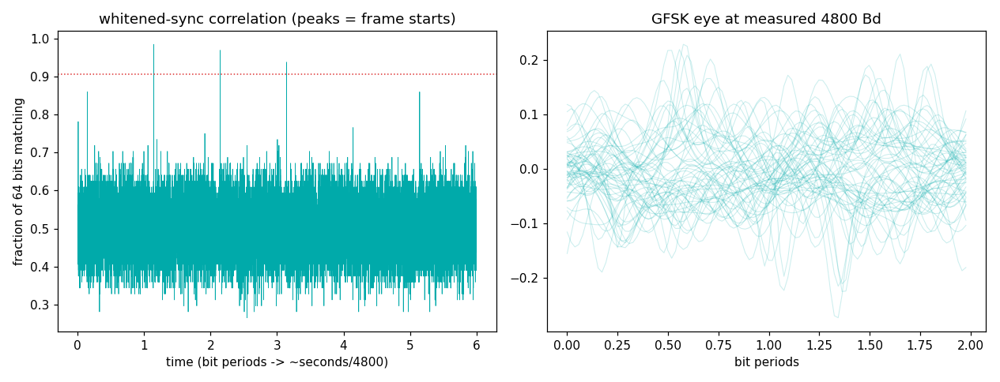

# Vaisala RS41 radiosonde — the grid that falls out of the sky twice a day

Weather balloons launch worldwide at 00Z and 12Z. Each carries an RS41
transmitting its GPS position and PTU (pressure/temperature/humidity)
on ~400–406 MHz — receivable with rabbit ears from a hundred km away.

## The grid

| parameter | value | why |
|---|---|---|
| Modulation | GFSK, ±~2.4 kHz deviation | cheap, robust, battery-friendly |
| Symbol rate | **4800 Bd** | |
| Frame | **320 bytes, one per second** | position updates at 1 Hz |
| Sync (on-air) | 64 bits: `0000100001101101010100111000100001000100011010010100100000011111` | see the trap below |
| Whitening | fixed LFSR mask over the whole frame | breaks up DC runs for the FM demod |
| FEC | **Reed-Solomon (255,231), GF(256), poly 0x11D** | two interleaved codewords; frame zero-padded to 518 bytes before RS |
| Position | ECEF x,y,z (cm) → lat/lon/alt | plus GPS week/ms, so you get time too |

## The traps (we hit every one)

1. **The sync you correlate for is the *whitened, on-air* bit
   pattern** — not the datasheet's frame-header bytes, and not the hex
   rendered MSB-first. Byte bit-order transforms silently produce a
   pattern that never matches anything. *Constants must be proven
   against live signal* — our decoder scored zero for a day on a
   perfectly good capture because of this.
2. **Find the sonde by its FSK twin-lobe fingerprint** (two spectral
   humps 4.8 kHz apart), never by "strongest peak" — the strongest
   peak is usually an interferer. This script's own first two runs
   demonstrated it.
3. **Inter-frame gaps are not an integer bit count.** Track the bit
   clock per frame (chunk-wise eye tracking); a single free-running
   clock slips and shreds later frames. A per-frame sps *estimate*
   from sync spacing makes it worse — measure, don't extrapolate.
4. **Pad before RS.** The 320-byte frame is zero-extended to 518
   bytes before Reed-Solomon; skip it and RS "corrects" your GPS into
   the Atlantic. Trust only the frame's own CRC as final judge —
   erasure decoding can miscorrect confidently.

## What we measured (sonde 403 MHz, 2026-07-18 00Z flight over Virginia, RSPdx + rabbit ears)

```
FSK pair found: lobes -1862 / +2930 Hz -> carrier +534 Hz from center
symbol rate:    4800.1 Bd   (grid says 4800)
sync hits:      8 frames (64-bit whitened sync, >= 58/64 bits)
frame period:   1.000 s
```



Full decoder (whitening, RS, ECEF→lat/lon, CRC gating):
[wxTuna](https://github.com/Felbs/wxTuna) `tools/rs41_decode.py` — it
pulled 17/20 CRC-verified frames including live GPS fixes from this
flight.

## Reproduce it

```
python measure.py --iq your_capture.cs16 --fs 250000
```
Tune ~400.5–405 MHz around 00Z/12Z (check SondeHub for what's up near
you), capture 20+ s at 250 kS/s.
