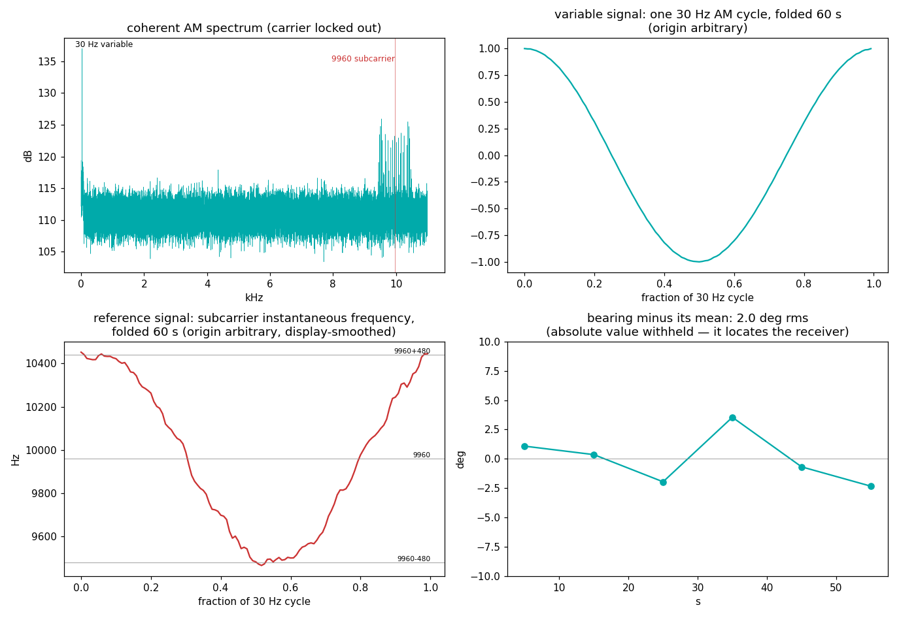
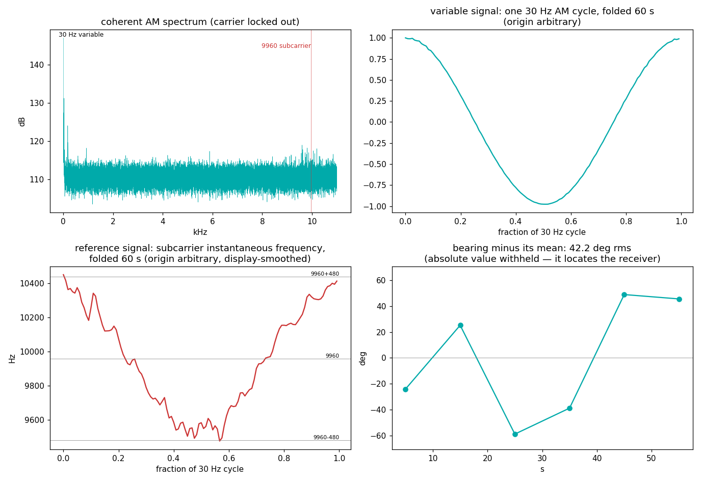

# VOR — the grid where a phase difference is a compass bearing

A VOR station (1949, still legally primary aviation navigation) is a
lighthouse you read with a voltmeter. It broadcasts two 30 Hz signals at
once: a **variable** one — a rotating antenna pattern that sweeps its
lobe past you 30 times a second, arriving as plain 30 Hz AM whose phase
depends on *where you stand* — and a **reference** one, sent as FM on a
9960 Hz subcarrier so that the AM path can't touch its phase. Subtract
the two phases and the radio hands you your magnetic bearing from the
station. No decoding, no data — the *grid itself* is the message.

## The grid

| element | value | why |
|---|---|---|
| Carrier | 108–117.95 MHz AM, 50 kHz channel plan | VHF: line of sight, multipath-tame |
| Variable signal | **30 Hz AM, 30% depth** | the rotating cardioid sweeping past your antenna |
| Reference signal | **9960 Hz subcarrier, FM at 30 Hz, ±480 Hz deviation** (index 16), itself AM'd on at 30% | FM survives everything the AM channel does to phase |
| Nested clocks | **9960 = 332 × 30** | one station clock; the subcarrier's Bessel comb lands exactly on 30 Hz multiples |
| Bearing | phase(reference) − phase(variable) | the whole point — 1° of phase = 1° of azimuth |
| Ident | 1020 Hz Morse, keyed roughly every 10 s | so a pilot knows which lighthouse |

## What we measured (three channels, roof discone, Virginia)

60 s at 250 kS/s on each of three channels of the local VOR plan. The
carriers turned out to sit **16–31 dB below the noise in their own
30 kHz channel** (C/N₀ 27, 29 and 14 dB-Hz — a discone at 113 MHz is
nobody's idea of a nav antenna), which killed envelope detection
outright and forced the whole measurement coherent: lock the carrier in
a few-hertz band, take Re(·)
as the AM, and pull the reference out with a matched filter for the one
waveform an FM subcarrier can be, `e^{jβ·sin(2π·30t+ψ)}`, scanned over
the published ±1% subcarrier tolerance and all ψ. Everything below
survived a synthetic-transmitter rehearsal at the same C/N₀ first
(`measure.py --selftest`: known bearing 237° in, 236.7° ± 2.5° out).

The strongest channel, 113.5 MHz:

```
carrier offset:      -479.2 Hz from dial   C/N0 =  29.1 dB-Hz
variable 30 Hz:     29.9993 Hz (29 dB)   AM depth 0.291 (published 0.30)
subcarrier:         9959.73 Hz   depth 0.289 (published 9960, 0.30)
  ratio fsub/f30:   331.999      (published 332 - nested clocks)
  FM deviation:       485.9 Hz   (published +-480, index 16)
bearing:          recovered; stability 2.0 deg rms over 6 x 10 s blocks
  absolute value withheld - it would locate the receiver (--reveal-bearing to print)
```

| constant | published (ICAO Annex 10) | 113.5 MHz | 115.1 MHz |
|---|---|---|---|
| variable AM rate | 30 Hz | 29.9993 Hz | 29.9996 Hz |
| variable AM depth | 0.30 | 0.291 | 0.24 (C/N₀ 14 dB-Hz — noise-biased) |
| subcarrier | 9960 Hz ± 1% | 9959.73 Hz | 9959.86 Hz |
| subcarrier ÷ 30 Hz | 332 | **331.999** (±0.002) | **332.000** (±0.005) |
| FM deviation | ±480 Hz | ±486 Hz | ±489 Hz |
| subcarrier AM depth | 0.30 | 0.289 | 0.20 (noise-biased) |
| bearing stability | — | **2.0° rms** (10 s blocks), split-halves agree to 0.1° | 5.3° rms (15 s blocks) |
| 1020 Hz Morse ident | keyed, ~10 s period | not decodable in 60 s at this C/N₀ (see honesty notes) | same |

Both stations run their subcarrier at 332 × their measured 30 Hz — same
nested-clock trick as RDS's 57 kHz = 3 × pilot. The two stations sit off
nominal by *different* amounts (−23 and −13 ppm), but within each
station the subcarrier and the 30 Hz are off by the *same* factor — one
crystal each, aging independently, dividing perfectly.



Top-left: the coherent AM spectrum — the 30 Hz line at the left edge,
and the subcarrier's forest of Bessel lines filling exactly
9960 ± 480 Hz. Right/bottom: the two 30 Hz signals themselves,
folded over one cycle across the full 60 s — the variable as an AM
sinusoid, the reference as the subcarrier's instantaneous frequency
swinging 9480↔10440 Hz. Each fold uses its own arbitrary origin: the
*difference* of the two origins is the bearing, and that number stays
home. Bottom-right: that difference, block by block — flat to 2° rms.

The weakest channel's own figure is [vor_1151.png](figures/vor_1151.png)
— same grid at C/N₀ 14 dB-Hz. Its folded reference is mostly noise *to
the eye*; the matched filter, integrating the full 60 s, still finds the
subcarrier within 0.14 Hz of the strong channel's and holds the bearing
to 5° rms once the blocks are long enough (15 s) to contain it.



The 111.0 MHz channel is the honest failure: strongest 30 Hz line of the
three (29.9994 Hz, AM depth measured 0.37 against a 0.30 spec — the first
clue that something besides the station was in the channel), but its
bearing wanders ±40° between blocks and its subcarrier
comb is smeared until the matched filter can no longer tell adjacent
Bessel lines apart (fits at ±30 Hz offsets score within noise of each
other, where the clean channels separate 4×). The carrier also carries a
spread scatter pedestal that the others lack. That channel's candidate
station sits beside a major-airport arrival corridor; a VOR paper will
tell you what a fuselage at 200 kt does to a 30 Hz phase measurement,
and now so will we.

Honesty notes:

- **We could not decode the Morse idents**, so the three stations are
  *candidates*, not proven identities: the channels match the published
  Washington-area allocations (111.0/113.5/115.1), every measured grid
  constant is VOR, and the (withheld) bearings are mutually consistent
  with those three stations seen from one place in Virginia — but the
  definitive 3-letter proof stayed under the noise. We rehearsed the
  decode on a synthetic at the same C/N₀: a 1020 Hz ident at typical
  depth in 60 s carries about **1.5σ of information** — no decoder can
  fix that. A matched-filter hypothesis test (candidate keying templates
  vs a 250-strong null ensemble of random idents, identical freedoms)
  came back inconclusive on all three channels, as the rehearsal
  predicted it would. The fix is not cleverness, it's a longer tape.
- The first pass used envelope detection and it *lied plausibly*: a
  "subcarrier level" of 0.19 on every channel — including one that later
  measured 0.29 coherently — with bearings that were uniform noise. At
  −19 dB in-channel, the envelope of carrier+noise mostly measures the
  noise beating against itself. If two different channels hand you the
  same round number, suspect the method, not the ether.
- Two more traps the synthetic caught before the air did: parabolic
  interpolation of a 60 s FFT peak left a 3 mHz bias on the 30 Hz line —
  which is 73° of accumulated phase over the record — and an unwindowed
  carrier search once picked a leakage alias 176 Hz off. Fine phase work
  needs coherent frequency refinement and windowed searches.
- The matched filter has a lattice ambiguity: seeded one Bessel line off,
  it still locks (Σ JₖJₖ₊₁ ≠ 0) with a *lower* fitted amplitude. We
  disambiguate by trying ±2 lines and keeping the amplitude winner —
  proven on the synthetic, and the diagnostic that exposed 111.0's smear.
- Conventional and Doppler VOR are deliberately indistinguishable to a
  receiver (DVOR swaps which signal is which and reverses rotation so
  the arithmetic comes out the same); we make no claim about which kind
  these are.
- TX and RX clock errors are entangled in every baseband number: the
  ~23 ppm can be split between the stations' crystals and ours. The
  332 ratio is immune (both tones ride the same capture clock).

## Reproduce it

```
python measure.py --selftest                        # the method proves itself first
python measure.py --iq your_capture.cs16 --fs 250000 --figures
```

Tune any local VOR channel (108–117.95 MHz, the aviation charts are
public), 60 s of int16 interleaved IQ, any antenna with a view toward
the station. By default the script prints the bearing's *stability* and
withholds its value — two published bearings put a pin on your roof;
`--reveal-bearing` prints it for your eyes. Capture 5–10 minutes instead
of one and the Morse ident comes out of the noise too — then you'll
know your lighthouse by name.
