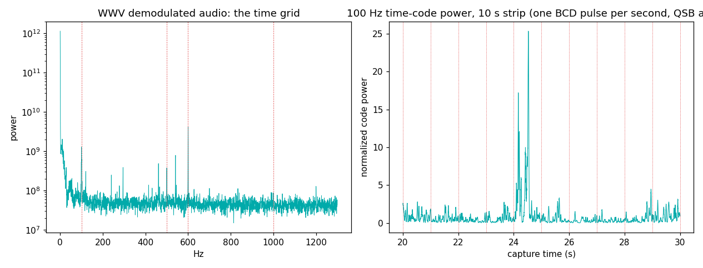

# WWV — the grid that *is* time

NIST's shortwave time station in Fort Collins, Colorado: 2.5, 5, 10,
15, 20 MHz, AM, continuously since 1923 (the oldest continuously
operating radio station in the world). Every element of the signal is
derived from cesium clocks. There is no "data" here in the modern
sense — the structure itself is the payload.

## The grid

| element | value | when |
|---|---|---|
| Second tick | 5 ms of 1000 Hz | every second (except :29, :59) |
| Minute mark | 0.8 s of 1000 Hz | on the minute |
| Time code | **100 Hz subcarrier**, one BCD bit/second (0.17/0.47/0.77 s pulse widths) | continuous — a full timestamp every minute |
| Standard tones | **500 Hz / 600 Hz** on alternating minutes | audio-frequency calibration |
| Voice | time announcements | seconds 52.5–60 |
| Carrier | the frequency itself is the standard | always |

Everything is harmonically related and clock-derived: hear WWV and
you're holding a piece of NIST's cesium ensemble, softened by two
thousand miles of ionosphere.

## What we measured (10 MHz, 9 PM EDT July evening, roof discone, Virginia)

```
100 Hz time-code subcarrier: +14.4 dB above floor
500 Hz standard tone:         +9.1 dB
600 Hz standard tone:        +19.5 dB
1000 Hz (ticks/minute mark):  +2.8 dB
per-second fold: inconclusive under this capture's HF fading
```



Honesty notes, because this entry earned them:

- The 500/600 dB difference is real grid behavior: the tones alternate
  by minute, and our 90 s capture caught more 600-minutes.
- **Two failed measurements are part of this entry's history.** An
  early version claimed our SDR's clock was 440 ppm off NIST — from
  folding weak ticks with a bandpass filter that was mathematically
  incapable of its own passband (100 Hz wide at 25 kHz sample rate in
  401 taps: mush). A 0.5 ppm TCXO cannot be 440 ppm off; when a
  measurement contradicts a spec by three orders of magnitude, the
  measurement is broken. Envelope folds under evening HF fading (QSB
  swamps per-second contrast) genuinely cannot do ppm work — that
  needs carrier-phase methods and a quieter band. The script now says
  "inconclusive" instead of inventing precision.

## Reproduce it

```
python measure.py --iq your_capture.cs16 --fs 250000
```
Tune 10 MHz (or 5/15), 90+ s. Best after local midnight; on a good
night you can fold the 100 Hz code into a textbook one-second comb.
