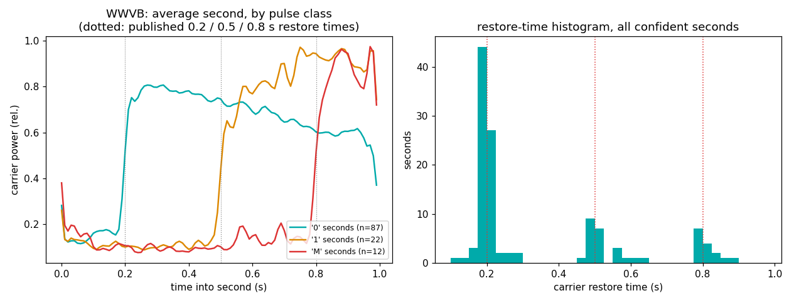
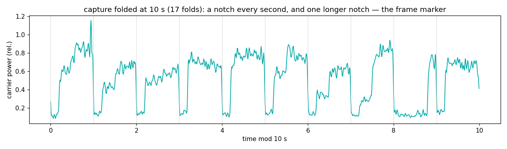

# WWVB — one bit per second, sixty thousand cycles per bit

NIST's longwave time station on **60 kHz** (Fort Collins, Colorado) —
the signal that sets every "atomic" wall clock and wristwatch in North
America. Where its shortwave sibling [WWV](../wwv-time/) talks (voice,
ticks, tones), WWVB does exactly one thing: it drops its carrier power
once per second, and *how long it stays down* is the data.

## The grid

| element | value | why |
|---|---|---|
| Carrier | 60 kHz, cesium-derived | groundwave covers a continent; buildings barely attenuate it |
| Modulation | pulse-width AM: power drops ~17 dB at each second | a one-transistor receiver can decode it |
| bit 0 | carrier low for **0.2 s** | |
| bit 1 | carrier low for **0.5 s** | |
| frame marker | carrier low for **0.8 s** | seconds 9, 19, 29, 39, 49, 59 — plus second 0, so the minute starts with two markers back-to-back |
| Frame | 60 s = one full BCD date/time | minute, hour, day-of-year, year, DUT1, leap flags |
| (modern) | BPSK time code added 2012 | invisible to the power envelope measured here |

The whole design is a bet on simplicity: at 1 bit/s a frame takes a
minute, but the receiver needs no carrier recovery, no clock recovery,
no equalizer — just an envelope detector and a stopwatch. The grid is
so slow it's almost visible by eye on a power meter.

## What we measured (60 kHz, 1 AM EDT July, roof discone, Virginia)

180 s captured at 05:00 UTC — longwave needs the post-sunset D-layer
collapse to cross the ~2400 km from Colorado:

```
1 Hz second comb: line +32.8 dB above floor, period 0.999963 s
carrier power drop (envelope p85 -> p8): 11.7 dB
confident seconds: 121/173  {'0': 87, '1': 22, 'M': 12}
  width '0': n= 81  mean 0.194 s  sd 21 ms  (published 0.2 s)
  width '1': n= 21  mean 0.515 s  sd 44 ms  (published 0.5 s)
  width 'M': n= 11  mean 0.797 s  sd 13 ms  (published 0.8 s)
marker comb: 12 confident markers, phase 8.08 s mod 10, R = 1.000
```

| constant | published | measured |
|---|---|---|
| second period | 1 s | 0.999963 s (−37 ppm ≈ our envelope-fold resolution, not a clock claim) |
| bit-0 low time | 0.2 s | 0.194 s ± 21 ms |
| bit-1 low time | 0.5 s | 0.515 s ± 44 ms |
| marker low time | 0.8 s | 0.797 s ± 13 ms |
| marker spacing | every 10 s | 10 s comb, circular coherence R = 1.000 (12/12) |
| power drop | ~17 dB | 11.7 dB (floor-limited: our noise floor fills the notch bottom) |



The left panel is the payoff: average all the seconds the classifier
called '0', '1', and 'M' separately, and three clean restore edges
stand up exactly on the published 0.2 / 0.5 / 0.8 s lines. The
histogram splits into three islands with nothing between them — a
pulse-width grid with real decision margins.



Fold the whole capture at 10 s and the frame structure appears without
any decoding: a notch at every second, and the one starting at
8 s-mod-10 stays down 0.8 s — the marker comb.

Honesty notes:

- We tuned dead-on 60.000 kHz, so WWVB's carrier sits at our zero-IF
  **DC**, indistinguishable from the SDR's own DC offset in a zoom
  FFT. Carrier-frequency precision is therefore not claimed here; the
  measurement is the *envelope* grid. (Tune 500 Hz off to do better.)
- The measured drop depth (11.7 dB) is smaller than the published
  ~17 dB because the notch bottom lands on our nighttime LW noise
  floor + summer static crashes. Same reason a third of seconds fail
  the confidence gate: single static crashes inside a 0.2 s window.

## Reproduce it

```
python measure.py --iq your_capture.cs16 --fs 250000
```
Tune 60 kHz (int16 interleaved IQ), 3 minutes, at night. Almost any
antenna works — we used a discone meant for VHF. If your seconds
histogram shows three islands, you are watching NIST set the clocks.
